# Businessprocessen
## Inleiding en afspraken
### Je kan uitleggen wat BITA of Business IT Alignment inhoudt.
* Business - IT allignement
* 
### Je kan het belang van BITA in de bedrijfswereld schetsen.
* muur tussen beiden opheffen
### Je kan het alignment of afstemmingsmodel van Henderson en Venkatraman uitleggen en tekenen.

* Het strategic alignment model van Henderson en Venkatraman wordt wel beschouwd als de ‘moeder’ van alle modellen waarin de rol van ICT binnen een organisatie op strategisch niveau beschreven wordt. Het model maakt inzichtelijk dat alle vier de invalshoeken met elkaar in balans moeten zijn: er moet sprake zijn afstemming en/of aansluiting tussen het strategisch en operationele niveau en tussen het business- en IT-domein.

### Je kan aan de hand van het afstemmingsmodel van Henderson en Venkatraman vier visies op alignment benoemen en verduidelijken.
* Strategische ontwikkeling:
    - In deze traditionele visie is de bedrijfsstrategie de drijvende kracht die de operatie van de organisatie bepaalt. 
    - ICT is gewoon een hulpmiddel (‘commodity’) zoals energie en huisvesting en moet de operationele behoeften zo goed mogelijk ondersteunen. Het is de minst glamoureuze rol voor ICT, met de kleinste strategische impact.

* Technologische transformatie:
    - In de tweede visie staat ICT wat hoger op de agenda. De organisatie formuleert een duidelijke bedrijfsstrategie met heldere scenario’s en plannen. 
    - Deze strategie wordt door de ICT afdeling opgepakt en omgezet in een ICT-strategie. Op deze wijze wordt bepaald aan welke eisen ICT moet voldoen en hoe ICT zich verder strategisch moet ontwikkelen.
* Concurrentieel voordeel:
    - Een nog prominentere rol is weggelegd voor ICT in de derde visie. 
    - ICT is een katalysator voor nieuwe ideeën en technologische innovatie van de organisatie. Deze ideeën worden opgepakt door de organisatie en meegenomen in de bedrijfsstrategie van waaruit deze ontwikkelingen een plek krijgen in de dagdagelijkse operaties.
* Serviceniveau:
    - In de laatste visie heeft ICT het hoogste volwassenheidsniveau bereikt. ICT denkt zoals de business.
    - Technologische innovaties zijn businessgericht uitgewerkt en worden bijgevolg moeiteloos door de organisatie opgenomen. Via een soort ‘AppStore’ worden nieuwe functionaliteiten in de businessprocessen geïntegreerd.

## H1 Business process management
### Je kan uitleggen wat een bedrijfsproces is.
* zet input(s) om in output(s) 
* draagt bij tot het bereiken van doelstellingen
* creëert toegevoegde waarde
* wordt aangestuurd door een vorige activiteit of door de tijd  (~event driven)
* wordt uitgevoerd door mensen in een bepaalde rol 
* wordt uitgevoerd op een of meerdere fysieke plaatsen
* is afdelingsoverschrijdend
* maakt gebruik van middelen: machines, applicaties, modellen, …
* moet voldoen aan regels (wet- en regelgeving) 

### Je kan een bedrijfsproces herkennen.
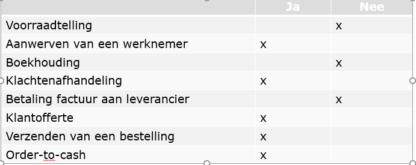
### Je kan de volgende afkortingen voluit schrijven en bondig toelichten: BPM, BPMN en BPR.
* BPM: 
    - Business Process Management
    - Continu proces van herkennen, beschrijven, herontwerwpen, implementeren en meten van bedrijfsprocessen met het oog op verbetering
* BPMN: 
    - Business Process Modeling & Notation
    - Een verzameling objecten en symbolen om bedrijfsprocessen te modelleren.
* BPR: 
    - Business Process Re-engeneering
    - Fundamenteel "re-thinking and radical re-design" van businessprocessen om duurzame maatregelen in prestatie te berijken. Zoals kost, kwaliteit, service en snelheid.

### Je kent het doel van BPMN in het kader van Business IT Alignment.
communicatie; Kloof dichten tussen business en IT.
### Je kan uitleggen wat primaire, secundaire en managementprocessen zijn.
* Primaire of bewerkende processen:
    - Inkomende logistiek, productie, distributie, verkoop, dienst na verkoop -> transformatie
* Secundaire of ondersteunende processen: 
    - Infrastructuur, HR, Inkopen, R &D
### Je kent het onderscheid tussen een functioneel en een operationeel proces.

### Je kan uitleggen waarom functionele processen geen bedrijfsprocessen zijn.

### Je kan verduidelijken wat een functionele organisatiestructuur inhoudt.
* Afdelingen op basis van bedrijfsfunctie en competenties
* Sturing top-down via hiërarchie
* Prestatie indicatoren per afdeling
* Silo denken, eiland denken
* Suboptimalisatie per afdeling
* Afdelingen die elkaar tegenwerken
* Weinig betrokkenheid met eindproduct
### Je kan verduidelijken wat een procesgeoriënteerde organisatiestructuur inhoudt.
* (matrix-organisatie)
* Focus op end-to-end verantwoordelijkheid
* Werknemers kijken verder dan de eigen werkplek
* Keten denken
* Meer focus op klant
* Meer aandacht voor core business
* Gericht op corrigeren en verbeteren
* Werking sneller aanpasbaar
### Je kan 5 externe en 5 interne bedrijfsregels opsommen die het modelleren van bedrijfsprocessen beïnvloeden.
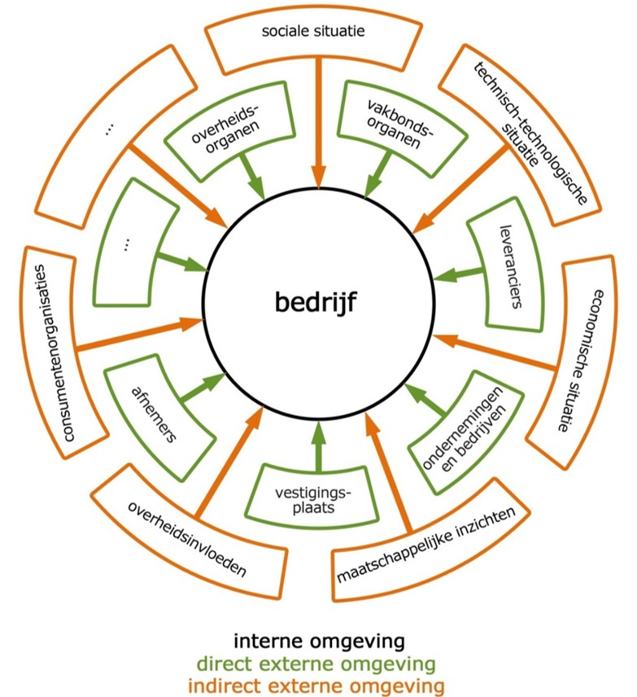
### Je kan het concept regulatory compliance verduidelijken.
* Bedrijfvan moeten kunnen garanderen dat hun bedrijfsprocessen en zeker hun boekhoudkundige registraties conform zijn aan wetten en kwaliteitsnormen.
### Je kan 1 praktijkvoorbeeld van BPR uitleggen zonder extra opzoekwerk.
* Wal-Mart bestelde zelf voorraad bij fabrikanten als Proctor and Gamble.  Resultaat was ofwel te kleine ofwel te grote voorraden.
* Na een BPR-proces verzorgt Proctor and Gamble zelf de voorraden bij WalMart omdat zij beter inzicht hebben in de tendensen op de markt.
* Resultaat: beter voorraadbeheer;  effectiever aanvullen van de voorraden

### Je kan de meest gebruikte symbolen uit het BMPN 2.0-schema bondig beschrijven.
#### Swimlanes
- Bestaan uit:
    * Pools:
        - Bakent grenzen van proces af voor een entiteit
        - Binnen 1 pool: slechts 1 proces
    * Lanes:
        - In een pool kunnen activiteiten gegroepeerd worden in lanes.
        - Activiteiten in zelfde lane worden uitgevoerd door zelfde verantwoordelijke
        - Kunnen onderverdeeld worden in sublanes
- Bepalen swimlanes: stap 1 bij modelleren
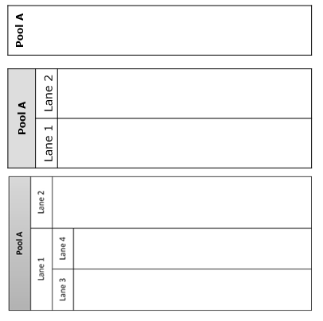
#### Pools en message flows
* Communicatie of uitwisseling data tussen pools -> Message flow 

* Sequence Flow kan nooit tussen 2 pools!
* Voorbeeld:
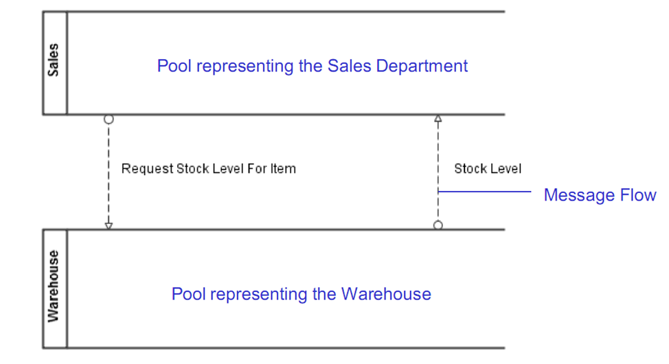

#### Basis Gateway symbolen
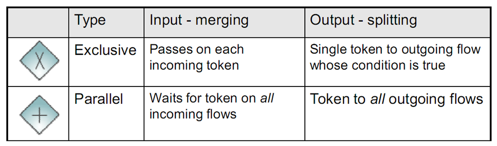
##### Exlusive gateway
* Exclusive Input Merging:
Als meerdere stromen samen komen start de uitgaande flow wanneer er 1 input is binnengekomen
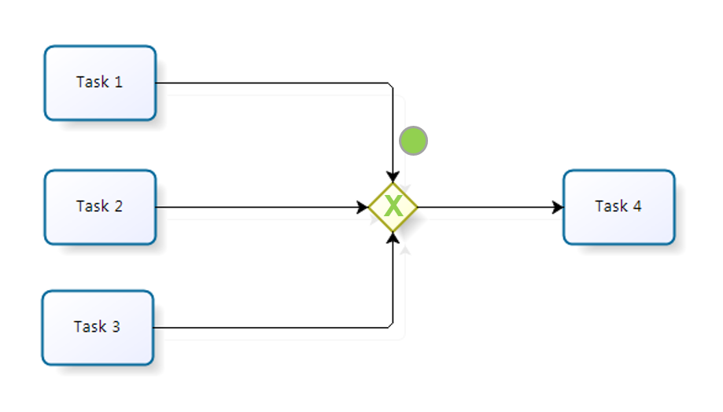
* Exclusive output splitting:
Bij splitsen van stromen wordt flow naar exact 1 uitgaande stroom gestuurd (conditie true)
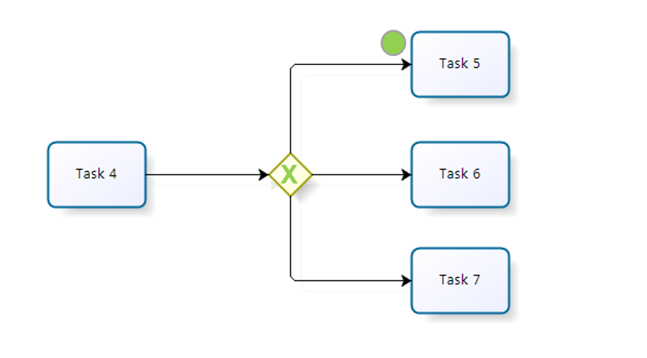
* Voorbeeld:
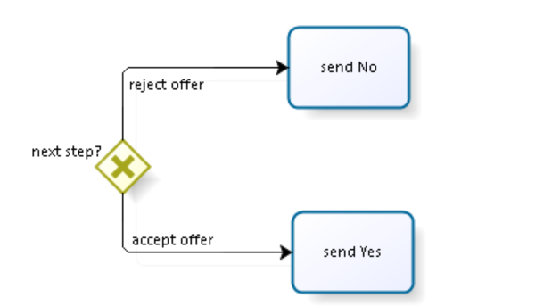
##### Parallel Gateway
* Paralell Input Merging:
Als meerdere stromen samen komen -> uitgaande stroom wacht tot alle inkomende stromen binnen zijn
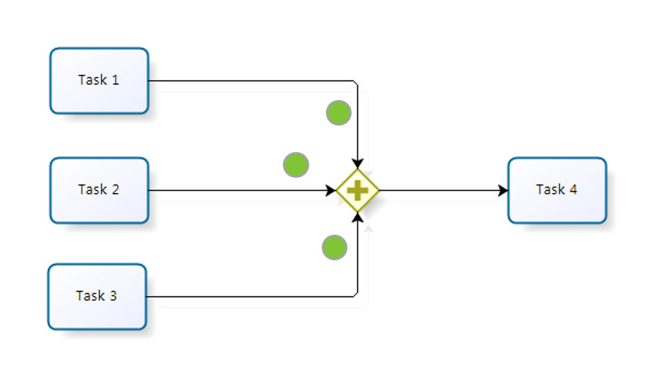
* Parallel output splitting:
Bij splitsen van inkomende stroom worden alle uitgaande stromen tegelijkertijd geactiveerd
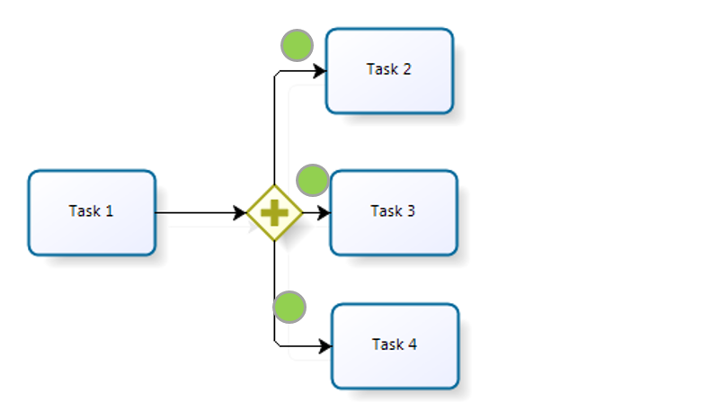
* Voorbeeld:
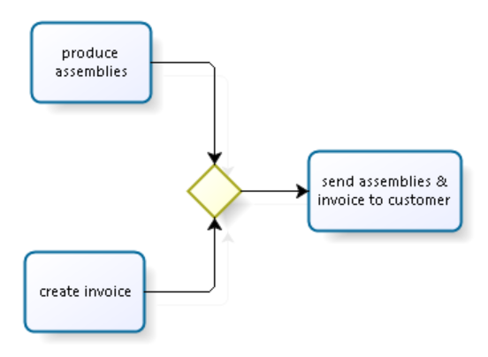

### Je kan op basis van een gegeven BPMN 2.0-schema een bedrijfsproces in woorden omschrijven.
(praktijk)

### Je kan een in woorden omschreven bedrijfsproces modelleren in BPMN 2.0.  Je kan dit op papier en met behulp van Bizagi Process Modeler.
(praktijk)

### Je kan fouten herkennen in een BPMN 2.0 schema.

### Je kan op basis van een BPMN 2.0-schema voorstellen formuleren om het proces grondig te herwerken tijdens een BPR-run.
(praktijk)

### Je kan op basis van een BPMN 2.0-schema de pijnpunten in het bedrijfsproces herkennen en beschrijven.
(praktijk)
### Je kan een voorbeeld geven waarbij de technologie de stimulator was tot een grondige vernieuwing van het proces.

### Je kan een voorbeeld geven waarbij het wijzigen van het proces de aanzet is tot het ontwikkelen van nieuwe technologieën.

