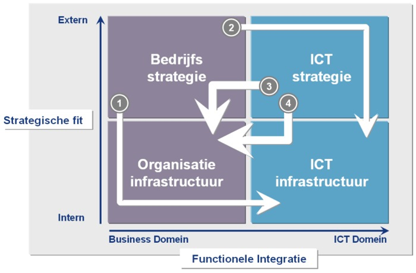

# Businessprocessen
## Inleiding en afspraken
* Je kan uitleggen wat BITA of Business IT Alignment inhoudt.
    - Business - IT allignement
    - 
* Je kan het belang van BITA in de bedrijfswereld schetsen.
    - muur tussen beiden opheffen
* Je kan het alignment of afstemmingsmodel van Henderson en Venkatraman uitleggen en tekenen.
    - 
    - Het strategic alignment model van Henderson en Venkatraman wordt wel beschouwd als de ‘moeder’ van alle modellen waarin de rol van ICT binnen een organisatie op strategisch niveau beschreven wordt. Het model maakt inzichtelijk dat alle vier de invalshoeken met elkaar in balans moeten zijn: er moet sprake zijn afstemming en/of aansluiting tussen het strategisch en operationele niveau en tussen het business- en IT-domein.

* Je kan aan de hand van het afstemmingsmodel van Henderson en Venkatraman vier visies op alignment benoemen en verduidelijken.
* Je begrijpt de rol en het belang van ICT bij elk van deze vier visies.  
